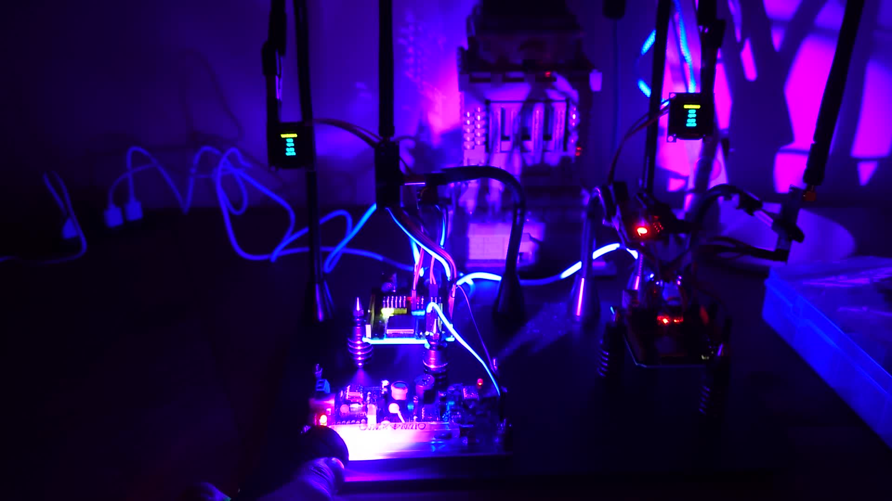

# Rad

---

A system for wireless sensors.

---

AES 128 encrypted transmissions between the command server and sensor nodes.

---

Sensor nodes can easily be in one of three modes at compile time: (1) Transmit only, (2) Receive only (3) Transmit and receive.

---

---

Requirements:

2x KEYESTUDIO ESP32 WROOM Development Board

2x NRF24L01+PA+LNA Wireless Transceivers.

2x SSD1306 128x64 OLED modules.

