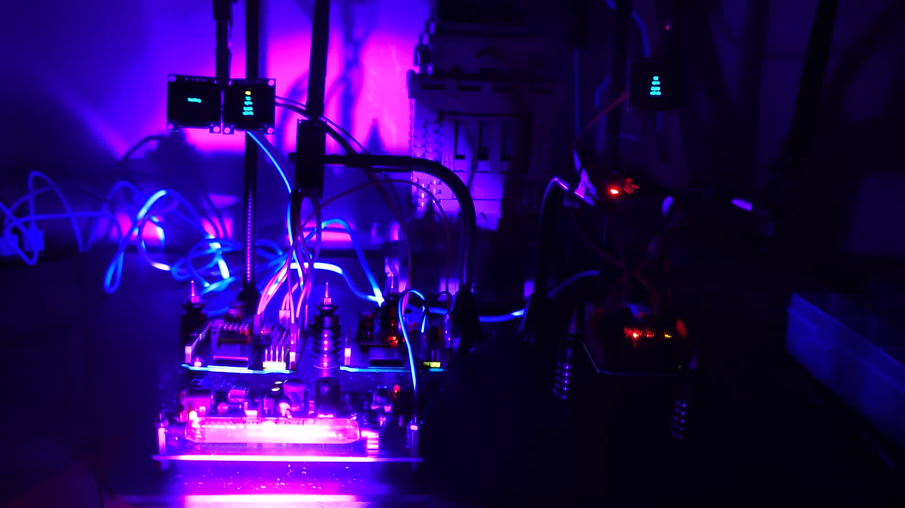
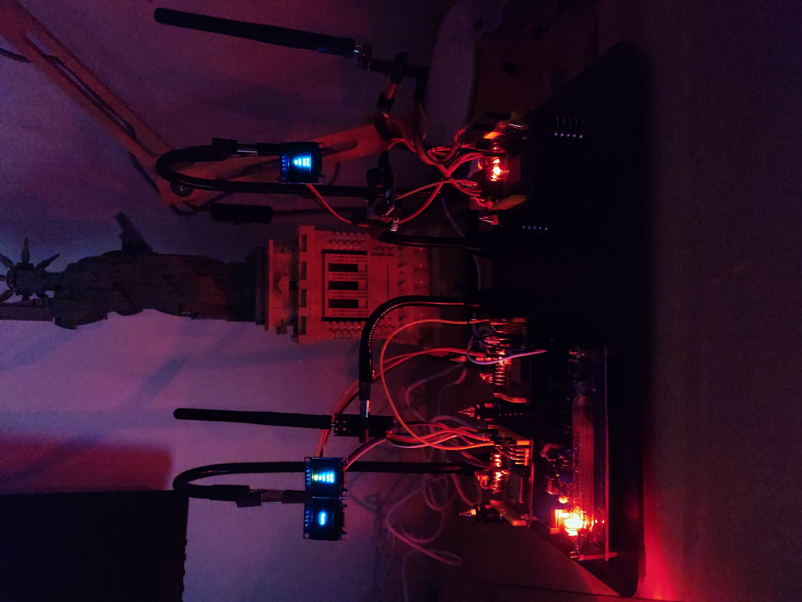
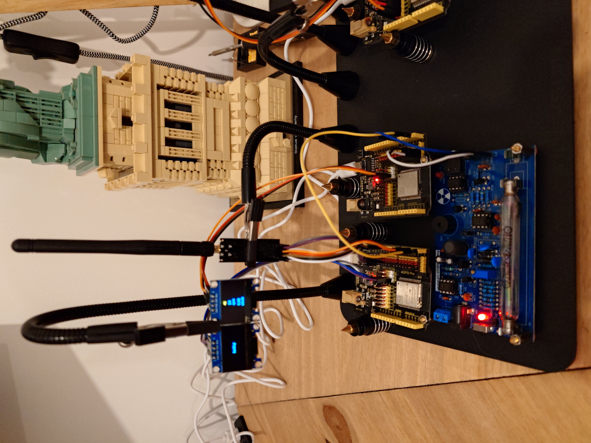
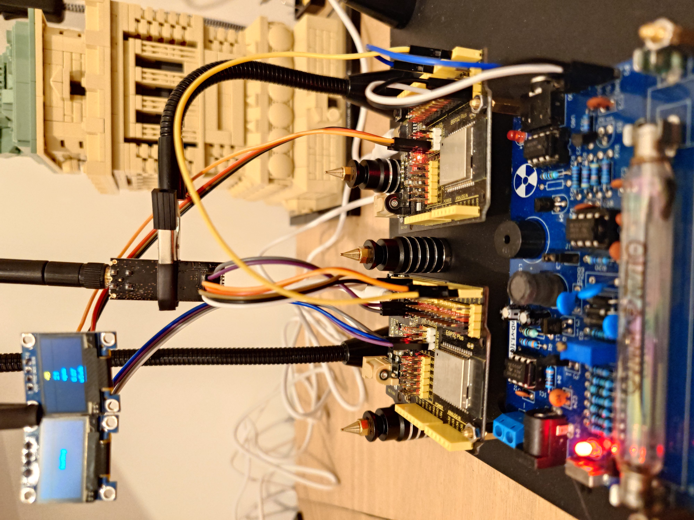
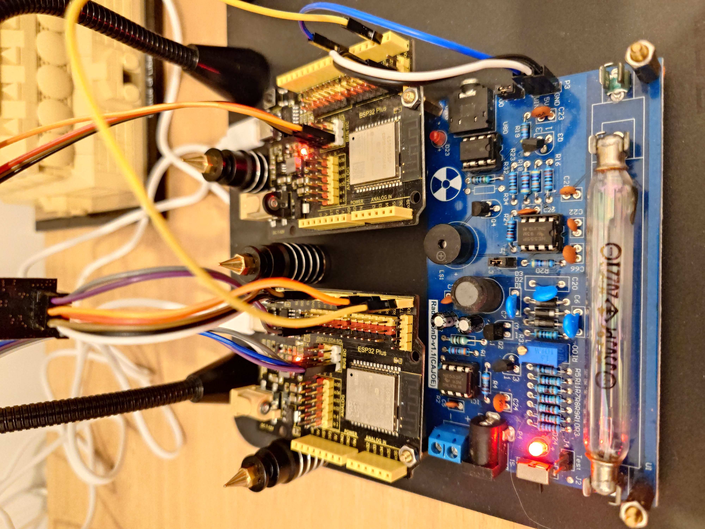
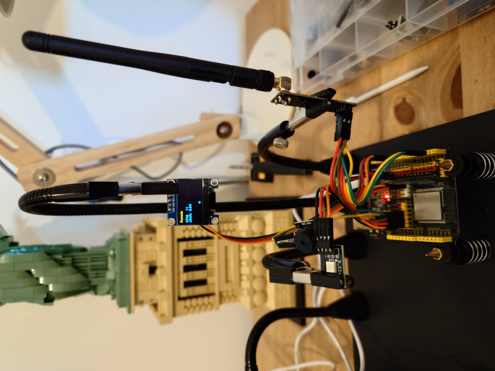
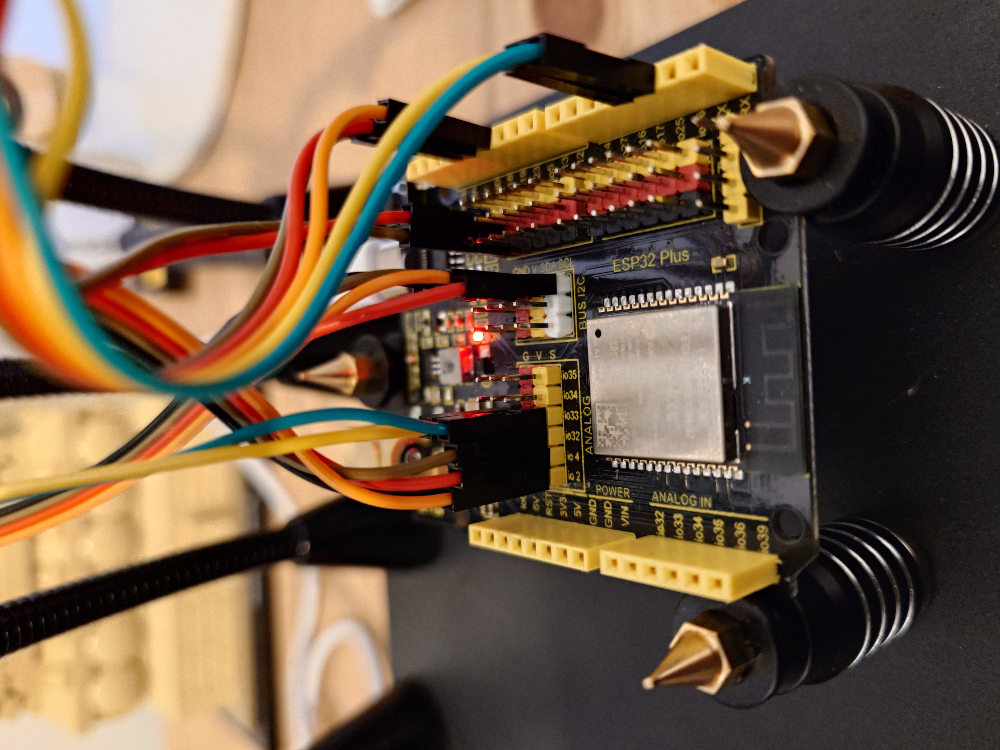

# Rad

A remote embedded system guiger counter.

Measures true zero, background, low and high radioactivity.

DO NOT USE UNTIL SANITIZED. UNDERGOING.

This system does not estimate CPM, instead CPM values are updated as rapidly as the system can manage (clock speed).
CPM is displayed on the transmitters ssd1306 OLED display and CPM is also transmitted over RF24 intended for the
receiver ESP32 to read remotely for remote observation.

Rad requires a sixty second warm up to aquire precion CPM.

Max reading is currently around 10240 due to memory limitation pertaining to the way Rad calculates CPM.

Extremely sensitive to sunlight unless geiger muller tube is covered. 

Requires system remains on. If the system looses power then you have at least sixty seconds before precision CPM can
be updated.

Requirements:

2x KEYESTUDIO ESP32 WROOM Development Board

2x NRF24L01+PA+LNA Wireless Transceivers.

1x Assembled Radiation Detector System. In this case RadiationD-v1.1(CAJOE).

1x HW-508 sound module.

1x WS2812 RGB LED.

2x SSD1306 128x64 OLED modules.

Transmitter/Measuring Device: (reference)  

Remote Receiver Device: (reference)  

Note: Currently zero security on the tranceivers.
