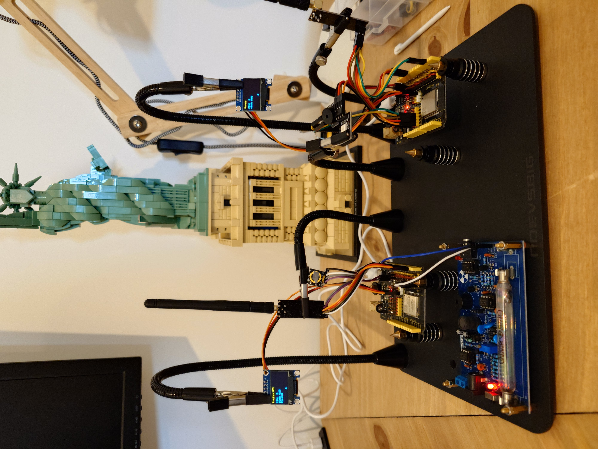

# Rad

An embedded system guiger counter.

Measures true zero, background, low and high radioactivity.

This system does not estimate CPM, instead CPM values are updated as rapidly as the system can manage (clock speed).
CPM is displayed on the transmitters ssd1306 OLED display and CPM is also transmitted over RF24 intended for the
receiver ESP32 to read remotely for remote observation.

Rad requires a sixty second warm up to aquire precion CPM.

Max reading is currently around 10240 due to memory limitation pertaining to the way Rad calculates CPM.

Extremely sensitive to sunlight unless geiger muller tube is covered. 

Requires system remains on. If the system looses power then you have at least sixty seconds before precision CPM can
be updated.

Micro second precision.

If Precision time is us500 (microseconds) as on my ESP32, then the main loop is able to register up to 1xCount from
the geiger counter and remove N counts from countsArray in 500 microseconds. Precision time may increase/decrease
according to current CPM because countsArray will take longer to process.

Requirements:

2x ESP32 Dev Modules.

2x NRF24L01+PA+LNA Wireless Transceivers.

1x Assembled Radiation Detector System. In this case RadiationD-v1.1(CAJOE).

1x HW-508 sound module.

1x WS2812 RGB LED.

2x SSD1306 128x64 OLED modules.

1x DS3231 High Precision RTC.

The CPM Burst Guage may be isolated and then integrated into Rad to provide a reasonably accurate estimated CPM for the
sixty second warmup period, after which Rad no longer needs to estimate.

Bug: Arduino Micros() resets to zero after a period of time making all stored micros eternally non stale: update in progress.
Potential Fix: An RTC has been added and I have created a custom timestamp by concatinating UNIX time and micros().
